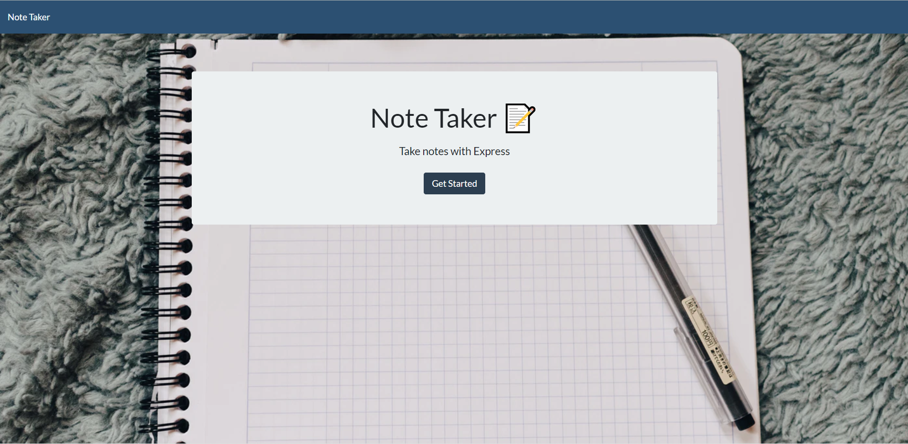
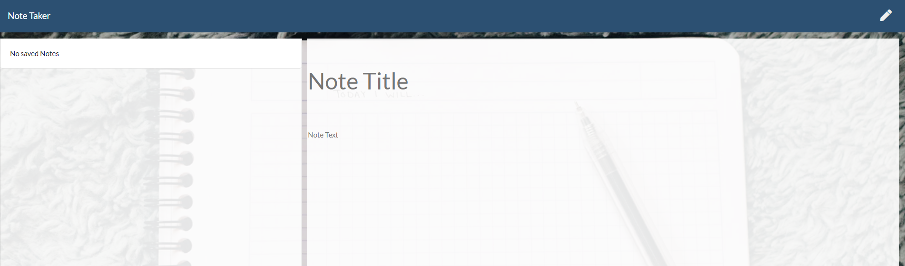
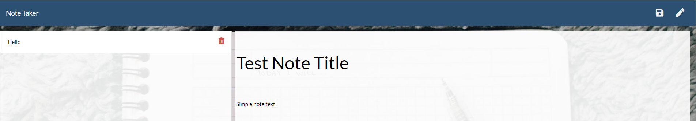

# NoteTaker Application

[Link to Webpage](https://notetaker-app-001.herokuapp.com/)

## Description 

This project was built for the user who would like to have a note saving app they can access from anywhere. This uses [NodeJS](https://nodejs.org/en/) to save the users inputs on the webpage to a json file. This app also used [ExpressJS](https://expressjs.com/) to route and send webpages back to the user

## Usage

This app is deployed on Heroku so the user can access the webpage at any time. Simply go to the [address provided](https://notetaker-app-001.herokuapp.com/), where you will be greated by a landing page. Click the get started button and you will be taken to the notes page.

If no notes are saved you will get a no saved notes on the left side. If there are notes there will be a list on the left where you can click and see a READ-ONLY version. You also have options to delete or add another note.

Once you input a note you would like to have there will be a save icon to hit and it will save to the db.json file used to store the notes.

## Credits

Website is built with Node JS, Express JS, HTML, CSS, and JS

## License

Copyright (c) Allister Rampenthal. All rights reserved.

Licensed under the [MIT](https://choosealicense.com/licenses/mit/) license
